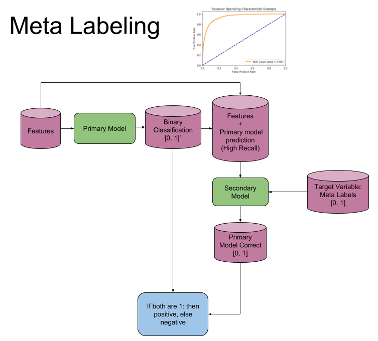

# An Overview: Triple-Barrier & Meta-Labeling Techniques

*note*: this image is from the original text, and is not my own work. also primary model can be adjusted to handle 
    long and short predictions.

The fixed-time horizon technique, a common strategy for labeling data in the world of financial research, isn't without
its flaws. Enter the triple-barrier method—a more dynamic approach that, when paired with meta-labeling, can
significantly boost efficacy.

From the Writings of Marcos Lopez de Prado:

Advances in Financial Machine Learning, Chapter 3
Machine Learning for Asset Managers, Chapter 5
Breaking Down the Triple-Barrier Method:

Three barriers define this method: the upper, the lower, and the vertical. The upper barrier sets the stage for buying
chances (label 1), while the lower barrier defines selling opportunities (label -1). Finally, the vertical barrier
imposes a time limit on observations, with the upper or lower barriers needing to be reached before an observation is labeled 0. Importantly, this method adjusts the upper and lower barriers based on each observation's volatility.

The Essence of Meta-Labeling:

This secondary machine learning model focuses on determining the optimal bet size, without worrying about the side of
the bet (long or short). As the secondary model filters false positives from the primary model, it bolsters overall
accuracy. Key benefits include morphing fundamental models into machine learning models, curbing overfitting,
developing sophisticated strategy structures, and refining decision-making regarding bet sizes.

Putting Meta-Labeling into Practice:

Develop a primary model with high recall, even if precision is low.
Compensate for low precision by applying meta-labeling to the primary model's positive predictions.
By filtering out false positives, meta-labeling enhances the F1-score while the primary model zeroes in on most
positives.
Implementation in Action:

A variety of functions are employed when using the triple-barrier method in tandem with meta-labeling, such as
add_vertical_barrier(), get_events(), get_bins(), and drop_labels(). Comprehensive descriptions of these functions are
available in the original texts.

In a nutshell, the triple-barrier method and meta-labeling work in concert to create a powerful approach to labeling
financial data, remedying the limitations of the fixed-time horizon method. This harmonious collaboration leads to more
precise predictions and more informed decision-making in the realm of financial markets.

# Short-Tutorial: Triple Barrier Meta Labeling Pipeline ( *local not on aws endpoint* )

In this tutorial, we will build a Triple Barrier Meta Labeling pipeline using the provided functions. This pipeline 
will take in a dataframe of historical data and return a labeled dataframe with features, primary model labels, 
and meta labels. We will use the following functions:

example_arb_strategy: Generates signals for entering and exiting trades based on the Bollinger Bands indicator.
daily_vol_triple_barrier_label_example: Applies a triple barrier labeling algorithm to generate a meta-labeled 
series.
save_output_data: Saves the meta-labeled DataFrame to an output file.
TBM_labeling: The main script that sets up input and output parameters and uses the other functions to generate a 
meta-labeled DataFrame.
Here's a step-by-step guide on how to use these functions:

Define your input data parameters in the INPUT_DATA_PARAMS dictionary, including the data file directories, data 
file names, column renaming, and more.

Define your Triple Barrier Labeling (TBL) parameters in the TBL_PARAMS dictionary, including profit-taking and 
stop-loss levels, minimum return, number of threads, and vertical barrier parameters.

Define your output data parameters in the OUTPUT_DATA_PARAMS dictionary, including the output file directory, 
output file name, and output file type.

Call the TBM_labeling function with your input data parameters, TBL parameters, and output data parameters.

Call the TBM_labeling function with the defined parameters

    labeled_data = TBM_labeling(
        input_data_params=INPUT_DATA_PARAMS,
        tbl_params=TBL_PARAMS,
        output_data_params=OUTPUT_DATA_PARAMS,
    )

This will execute the main script that:

    1. Loads the input data using the Genie_Loader module and converts it to a format compatible with the vectorbt 
        library.
    2. Generates buy, sell, and hold signals using the example_arb_strategy function.
    3. Applies the triple barrier labeling algorithm to the closing price series and labeled series using the 
        daily_vol_triple_barrier_label_example function, which generates a meta-labeled DataFrame.
    4. Saves the meta-labeled DataFrame to an output file using the save_output_data function.

The resulting labeled dataframe will contain the historical data along with the features, primary model labels, 
and meta labels. This can be used as input for further analysis or machine learning models.

# Some recommendations to improve the code:

Modularize the code by splitting it into smaller functions or classes: This will make the code easier to understand,
 maintain, and test. You can create separate functions or classes for handling data loading, processing, and saving.

Add docstrings and comments: While there are already docstrings in place for some functions, consider adding more 
detailed docstrings and comments throughout the code to explain the purpose and functionality of each section. This 
will make it easier for others to understand and contribute to the code.

Error handling: Add more error handling to ensure that the code can handle unexpected inputs or situations 
gracefully. For example, you can use try-except blocks to catch and handle exceptions that may occur during the 
execution of the code.

Use Python's logging module instead of print statements: Replace print statements with logging calls to provide 
more control over the output and log levels.

Remove hardcoded values and make them configurable: Instead of hardcoding values, consider using configuration 
files or command-line arguments to make the code more flexible and easier to adapt to different use cases.

Unit tests: Write unit tests to ensure the correctness of the code and prevent regressions when making changes.

Optimize performance: Profile the code to find performance bottlenecks and optimize them using efficient algorithms, 
data structures, or parallelism.

Use type hints: Add type hints to your functions and variables to help with code readability and allow for better 
linting and error checking.

Here's an example of how you might start refactoring the code:

    import logging
    
    # Set up logging
    logging.basicConfig(level=logging.INFO)
    logger = logging.getLogger(__name__)
    
    def load_data(input_data_params: dict) -> pd.DataFrame:
        """Load input data from the specified file or source."""
        # Load data logic here
        pass
    
    def process_data(data: pd.DataFrame, tbl_params: dict) -> pd.DataFrame:
        """Apply the triple barrier labeling algorithm to the input data."""
        # Process data logic here
        pass
    
    def save_data(data: pd.DataFrame, output_data_params: dict):
        """Save the processed data to the specified output file."""
        # Save data logic here
        pass
    
    def main(input_data_params: dict, tbl_params: dict, output_data_params: dict):
        data = load_data(input_data_params)
        processed_data = process_data(data, tbl_params)
        save_data(processed_data, output_data_params)
    
    if __name__ == "__main__":
        # Configuration dictionaries
        input_data_params = {...}
        tbl_params = {...}
        output_data_params = {...}
    
    main(input_data_params, tbl_params, output_data_params)
    
